# 🌤️ Weather Web Application

A modern, responsive Weather Web Application built using **HTML**, **CSS**, and **JavaScript**. This application allows users to search for any city and view real-time weather information using the **Open-Meteo API**. It features a clean glassmorphism interface, dark/light mode, responsive design, and a searchable history panel.

---

## 📌 Features

- Search weather by city name
- Real-time temperature
- Current weather condition
- Humidity information
- Wind speed
- Light & Dark mode
- Fully Responsive Design
- Search History Panel
- Glassmorphism UI
- Fast API integration
- Error handling for invalid city names
- Press **Enter** to search

---

## 🖥️ Responsive Layout

### Desktop
- Weather Section: **75%**
- History Panel: **25%**

### Tablet
- Weather Section: **50%**
- History Panel: **50%**

### Mobile
- Full-screen Weather Section
- Slide-out History Panel

---

## 🛠️ Technologies Used

- HTML5
- CSS3
- JavaScript (ES6)
- Font Awesome
- Open-Meteo Geocoding API
- Open-Meteo Weather API

---

## 📂 Project Structure

```
Weather-Web-App/
│
├── index.html
├── style.css
├── app.js
├── README.md
└── assets/
```

---

## 🚀 Getting Started

1. Clone the repository

```bash
git clone https://github.com/your-username/weather-web-app.git
```

2. Open the project folder.

3. Open `index.html` in your browser.

No additional installation is required.

---

## 🌐 APIs Used

### Geocoding API

Converts the city name into latitude and longitude.

```
https://geocoding-api.open-meteo.com/
```

### Weather API

Fetches real-time weather information.

```
https://api.open-meteo.com/
```

---

## 📊 Weather Information Displayed

- City Name
- Temperature
- Weather Condition
- Humidity
- Wind Speed

---

## 🎨 User Interface

- Glassmorphism Search Bar
- Transparent Weather Card
- Responsive Table
- Modern History Panel
- Smooth Animations
- Dark & Light Theme

---

## 📱 Responsive Design

The application is optimized for:

- 💻 Laptop
- 📱 Mobile
- 📱 Tablet

---

## 🔮 Future Improvements

- 5-Day Weather Forecast
- Hourly Forecast
- Weather Icons
- Sunrise & Sunset Time
- Air Quality Index
- UV Index
- Current Location Detection
- Favorite Cities
- Local Storage Search History
- Dynamic Weather Backgrounds
- Loading Animation

---

## 📸 Screenshots

### Initial Page
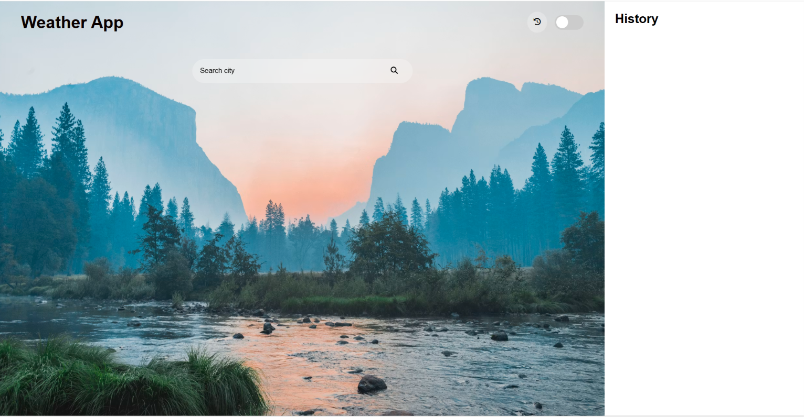

### Dark Theme
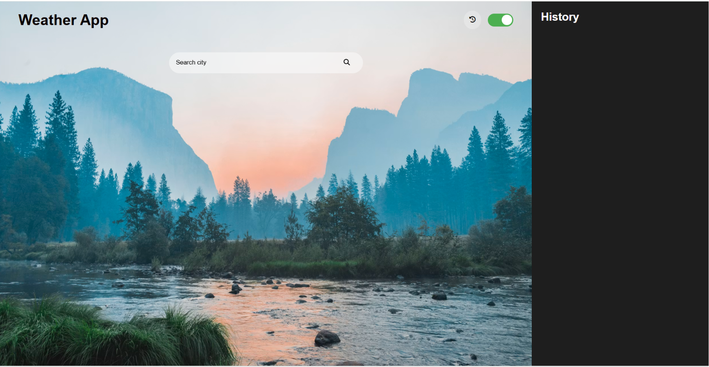

### Weather Details
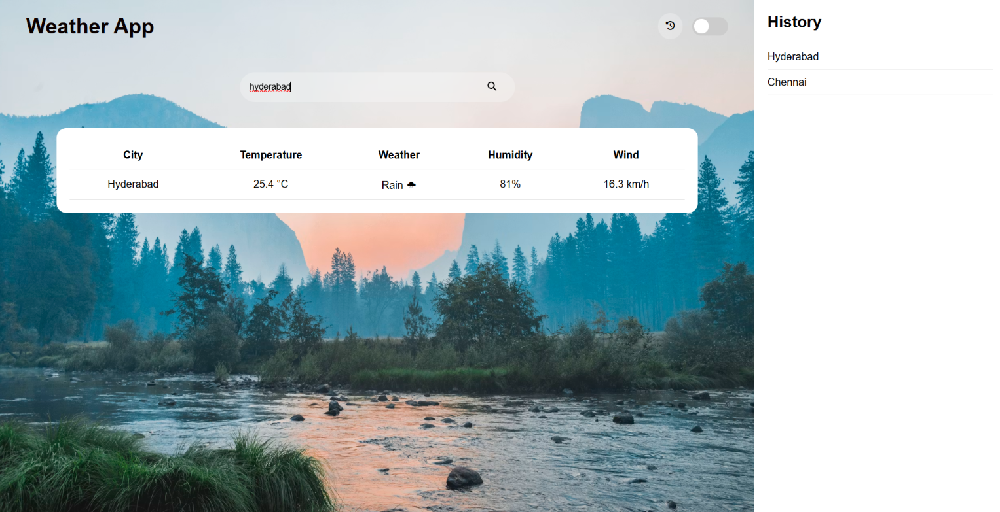

### Dark Theme Example
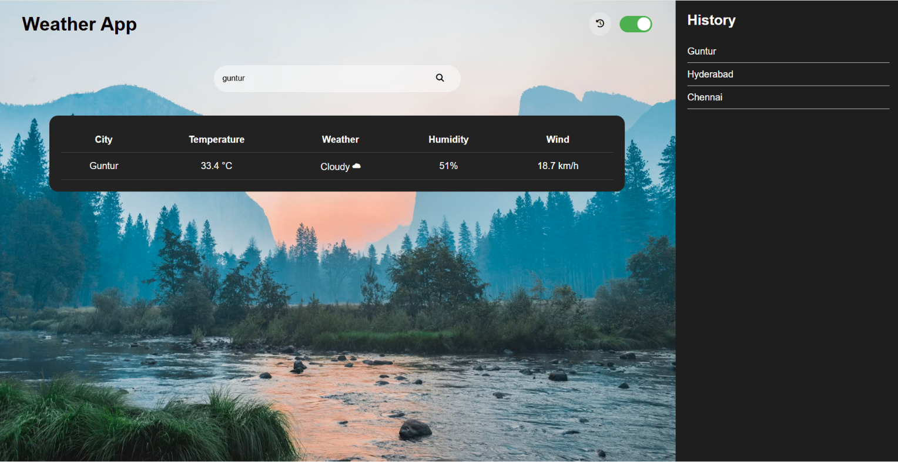

### Light Theme Example
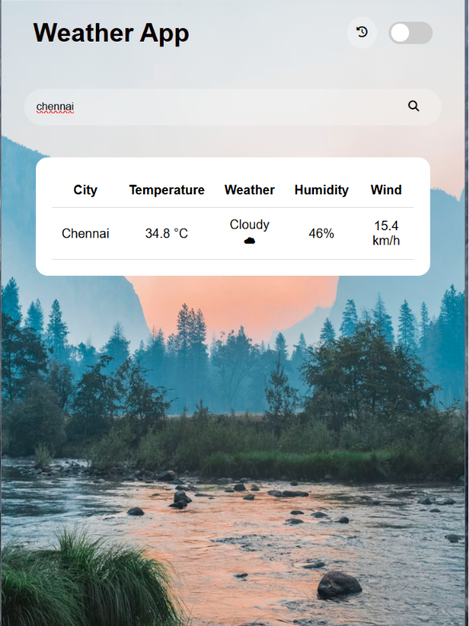

### Dark Theme Example
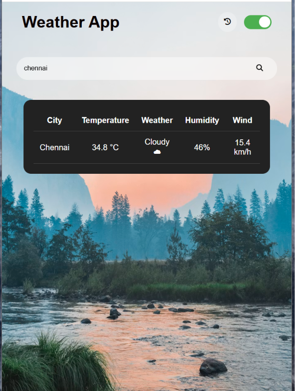

### City Not Found
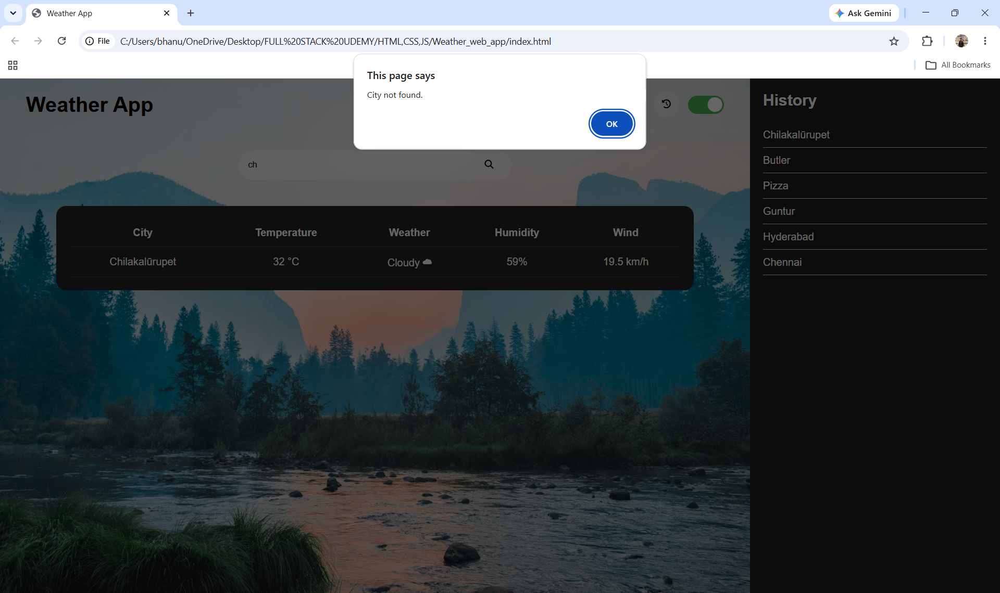

### Without City


### Responsive Light Theme
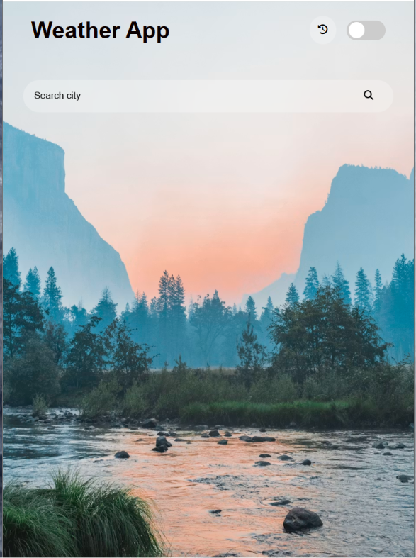

### Responsive History Display
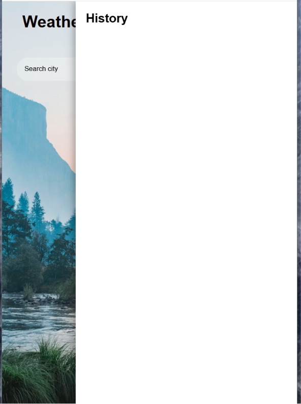

### Responsive History Display Dark
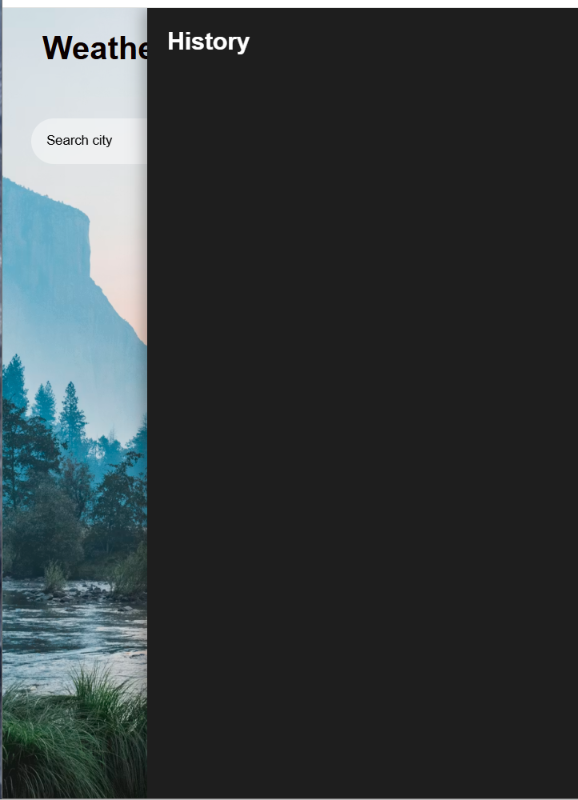

### History Dark Theme
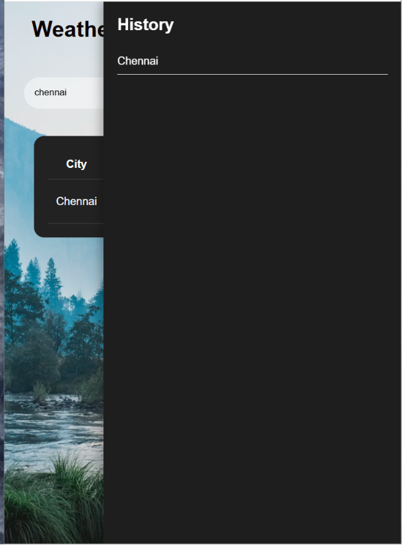

## Author
**Aravapalli Bhanu Venkata Naga Sai**

GitHub:
https://github.com/bhanu07052007

LinkedIn:
https://www.linkedin.com/in/bhanu-aravapalli/

---

## ⭐ Contributing

Contributions, issues, and feature requests are welcome.

If you like this project, consider giving it a ⭐ on GitHub.

---

## 📄 License

This project is created for educational and learning purposes.

Feel free to use and modify it.